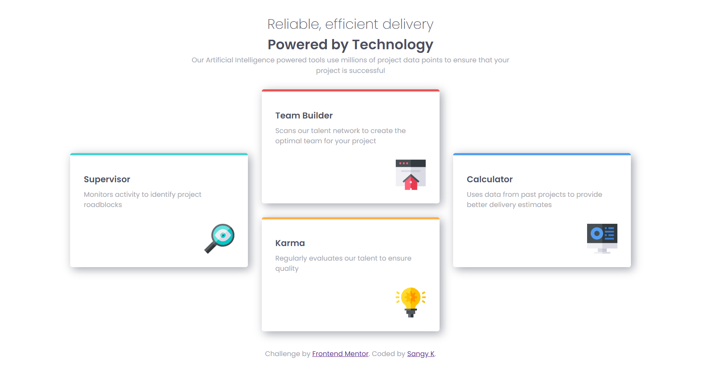

# Frontend Mentor - Four card feature section

**Desinged by [Sangy K](https://github.com/sansk) for [Frontend Mentor](https://www.frontendmentor.io) Challenge**

View the [Completed Page here](https://four-card-feature-section-frontendmentor-tau.vercel.app/).

## Used

CSS Flexbox, CSS Grids and CSS Variables.

**Feedback is always welcome**
